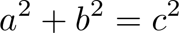

# quickly copy an image of a TeX equation

Today, in my Physics class (which is currently held on Microsoft Teams), someone complained about how clumsy it is to answer questions from the teacher in the chat box, because Teams doesn't support TeX rendering. For example, my classmates' answers to "what's the Pythagorean theorem?" might look like the following.

```
a^2 + b^2 = c^2
```

To fix this, I created a Bash script that automatically renders a given equation using LaTeX and copies the resulting PNG image to the clipboard, which can then be pasted into the Teams chat box. Doesn't this look much better?



For this to work on your system, you need to be using an Arch-based Linux distribution as well as the X Window System. Install [`tex2png`](https://aur.archlinux.org/packages/tex2png/), which renders TeX into a PNG image, and [`xclip`](https://github.com/astrand/xclip), which puts things in the clipboard. Then, download my script [equation2clipboard.sh](`equation2clipboard.sh`) and make it executable with `chmod +x equation2clipboard.sh`. I recommend making a Bash alias pointing to this script by opening the aliases file with `nano ~/.bash_aliases` and adding something like this on the bottom: `alias eq='~/scripts/equation2clipboard.sh'`. Here's an example of how to use the script:

```
eq "a^2+b^2=c^2"
```

Note that this script treats your input as display math. Also, one bug is that using `\text` causes the program not to do anything – I think this is an issue on `tex2png`'s side.
